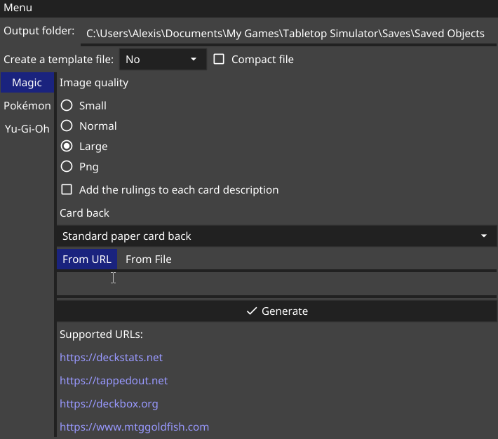

# Tabletop Simulator TCG Deck Converter

[](https://pkg.go.dev/github.com/jeandeaual/tts-deckconverter)
[](https://github.com/jeandeaual/tts-deckconverter/actions?query=workflow%3Abuild)
[](https://github.com/jeandeaual/tts-deckconverter/actions?query=workflow%3Atest)

Generate card decks for [Tabletop Simulator](https://www.tabletopsimulator.com/).

Inspired by [decker](https://github.com/Splizard/decker) and [Frogtown](https://www.frogtown.me/).



## Features

* Generate a Tabletop Simulator deck with thumbnail from an existing website or file.

* Save the generated deck directly in the Tabletop Simulator *Saved Objects*.

* Supports the following games:

    * Magic the Gathering

        * Import from the following websites:

            * <https://scryfall.com>
            * <https://deckstats.net>
            * <https://tappedout.net> (decks and cubes)
            * <https://deckbox.org>
            * <https://www.mtggoldfish.com>
            * <https://www.moxfield.com>
            * <https://manastack.com>
            * <https://archidekt.com>
            * <https://aetherhub.com>
            * <https://www.frogtown.me>
            * <https://www.cubetutor.com>
            * <https://cubecobra.com>
            * <https://mtg.wtf/deck>

        * Import from the following file formats:

            * MTGO
            * Magic Arena
            * Magic Workstation
            * `*.dec`
            * Cockatrice (`*.cod`)

        * Support for transform and meld cards. Implemented using [states](https://berserk-games.com/knowledgebase/creating-states/) (press `PgUp` or `PgDown` to switch between states).

        * Sideboard and Maybeboard support.

        * Automatically generate the required tokens and emblems for each deck.

        * Option to append the [Oracle rulings](https://scryfall.com/docs/api/rulings) to the card descriptions.

        * Oversized (Archenemy, Planechase and meld) card support (they'll appear twice as big as standard cards).

    * Yu-Gi-Oh!

        * Import from the following websites:

            * <https://ygoprodeck.com>
            * <https://yugiohtopdecks.com>
            * <https://yugioh.fandom.com> links containing a list of cards

        * Import from the following file formats:

            * `*.ydk`

        * Support for Master Duel (standard) and Rush Duel decks.

    * Pokémon TCG

        * Import from the following file formats:

            * `*.ptcgo`

    * Cardfight!! Vanguard

        * Import from the following websites:

            * <https://en.cf-vanguard.com/deckrecipe>
            * <https://cf-vanguard.com/deckrecipe>
            * <https://cardfight.fandom.com> links containing a list of cards

    * Custom cards

        * You can create custom decks from a list of image URLs or local paths, using the format \
        `<Count> <Image URL or path> (<Card name>)`:

        ```text
        1 https://example.com/cards/card1.png (Card Name 1)
        4 https://example.com/cards/card2.png (Card Name 2)
        2 C:\Users\User\Documents\Cards\card3.png (Card Name 3)
        C:\Users\User\Documents\Cards\card4.png
        ```

        `Count` is optional and defaults to 1, `Card name` is also optional.
        This will create a deck composed of 1 `card1.png`, 4 `card2.png`, 2 `card3.png` and 1 `card4.png` (with no name).

* Available as a command-line application and a GUI (built using [Fyne](https://fyne.io/)).

* Ability to customize the back of the cards.

* No external tool required. You just need to run the provided executable.

* Template mode

    By default, each card will have it's own image, retrieved from [Scryfall](https://scryfall.com/), [YGOPRODeck](https://db.ygoprodeck.com/) or <https://pokemontcg.io/>. \
    It's also possible to create a [card sheet template](https://kb.tabletopsimulator.com/custom-content/custom-deck/) (like what [decker](https://github.com/Splizard/decker) is doing). The template can be uploaded to Imgur automatically, or you can upload it manually to an image hosting site and update the `FaceURL` values in the deck's JSON file.

## Supported platforms

* Windows 7 or later
* macOS 10.11 or later
* Linux 2.6.23 or later

## Download

The latest release can be downloaded [here](https://github.com/jeandeaual/tts-deckconverter/releases).

Download the archive for your platform, extract it and run the program. No installation is required.

If you want the latest master build, go [here](https://github.com/jeandeaual/tts-deckconverter/actions?query=workflow%3Abuild), click on the topmost job, then download the appropriate package for your machine from the artifact list (e.g. `tts-deckconverter-gui-windows-amd64` for the Windows GUI or `tts-deckconverter-windows-amd64` for the Windows command-line interface).

## Building

[Go](https://golang.org/doc/install) 1.13 or newer is required.

### Command-line tool

```sh
go build ./cmd/tts-deckconverter
```

This will generate an executable called `tts-deckconverter`.

### GUI

Install the dependencies required by [Fyne](https://fyne.io/), listed [here](https://fyne.io/develop/index#prerequisites).

```sh
go build ./cmd/tts-deckconverter-gui
```

This will generate an executable called `tts-deckconverter-gui`.

## CLI usage

```text
$ ./tts-deckconverter -h

Usage: tts-deckconverter TARGET

Flags:
  -back string
        card back (cannot be used with "-backURL"):
  -backURL string
        custom URL for the card backs (cannot be used with "-back")
  -chest string
        save to the Tabletop Simulator chest folder (use "/" for the root folder) (cannot be used with "-output")
  -compact
        don't indent the resulting JSON file
  -debug
        enable debug logging
  -format string
        format of the deck (usually inferred from the input file name or URL, but required with stdin)
  -mode string
        available modes: mtg, pkm, ygo, cfv, custom
  -name string
        name of the deck (usually inferred from the input file name or URL, but required with stdin)
  -option value
        plugin specific option (can have multiple)
        mtg:
            quality (enum): image quality (default: normal)
            rulings (bool): add the rulings to each card description (default: false)
        pkm:
            quality (enum): image quality (default: hires)
        ygo:
            format (enum): duel format (default: Master Duel)
        cfv:
            lang (enum): Language of the cards (default: en)
            vanguard-first (bool): Put the first vanguard on top of the deck (default: true)
        custom: no option available
  -output string
        destination folder (defaults to the current folder) (cannot be used with "-chest")
  -template string
        download each images and create a deck template instead of referring to each image individually. Choose from the following uploaders:
            imgur: Upload the template(s) anonymously to Imgur.
            manual: Let the user manually upload the template.
  -version
        display the version information
```

### Usage examples

* Generate `Angelic Arrmy.json` under the TTS Saved Objects folder (`%USERPROFILE%/Documents/My Games/Tabletop Simulator/Saves/Saved Objects` on Windows), with normal size images from Scryfall and ruling information in the card's description:

    ```sh
    tts-deckconverter -chest / -option quality=normal -option rulings=true https://www.mtggoldfish.com/deck/2062036#paper
    ```

* Generate `Test Deck.json` under the `decks` folder:

    ```sh
    tts-deckconverter -mode mtg -output decks "Test Deck.txt"
    ```

* Generate `Starter Deck: Codebreaker.json` under the `YGO/Starter` folder in the TTS Saved Objects:

    ```sh
    tts-deckconverter -chest /YGO/Starter "Starter Deck: Codebreaker.ydk"
    ```

* Generate a single card from the standard input:

    ```sh
    echo "1 Black Lotus" | tts-deckconverter -mode mtg -name "Black Lotus" -
    ```

## Aknowledgements

Icon and card backs created using the [YGO Card Template](https://www.deviantart.com/holycrapwhitedragon/art/Yu-Gi-Oh-Back-Card-Template-695173962) (© 2017 - 2020 [HolyCrapWhiteDragon](https://www.deviantart.com/holycrapwhitedragon)).
